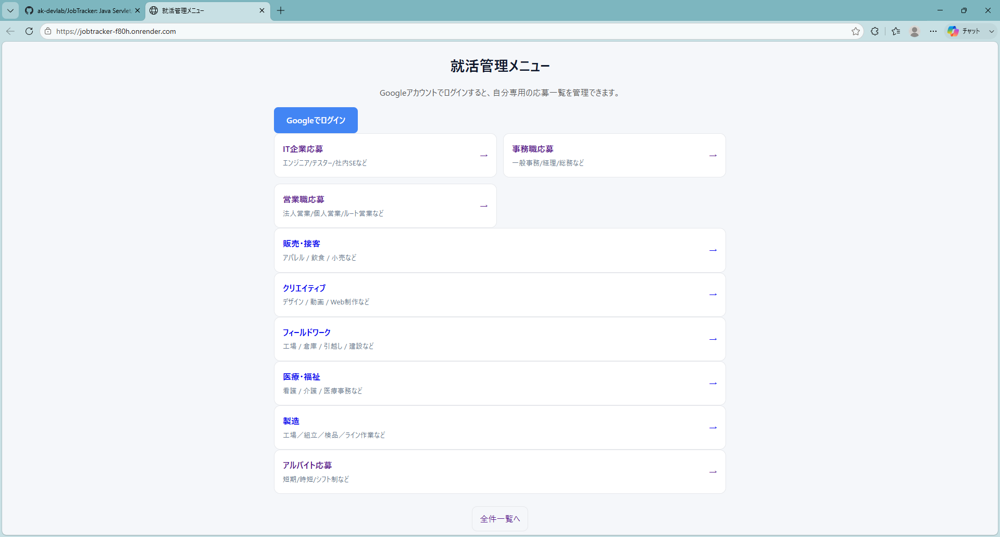
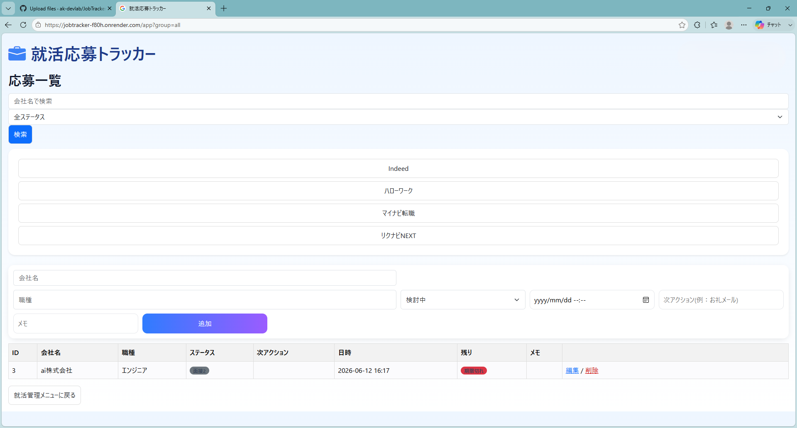

# 就活応募トラッカー

就活応募トラッカーは、応募した企業の情報・選考状況・次アクション・期限を管理できるWebアプリです。  
Googleログインに対応しており、ユーザーごとに応募データを分離して管理できます。

## URL

https://jobtracker-f80h.onrender.com/

## 画面イメージ

### トップページ

### 応募一覧画面

## 主な機能

- Googleアカウントでログイン
- ユーザーごとに応募データを管理
- 応募企業の追加・編集・削除
- 会社名で検索
- ステータス別の絞り込み
- 次アクション日による期限管理
- 職種カテゴリ別の応募管理
- 全件一覧表示

## 管理できる情報

- 会社名
- 職種
- 選考ステータス
- 次アクション
- 次アクション日時
- メモ

## 使用技術

### フロントエンド

- HTML
- CSS
- JSP
- Bootstrap Icons

### バックエンド

- Java
- Servlet
- JSP
- JDBC

### データベース

- PostgreSQL

### 認証

- Google OAuth Login

### インフラ・デプロイ

- Render
- GitHub

## 工夫した点

### ユーザーごとのデータ分離

Googleログイン後に取得したユーザー情報をデータベースに保存し、応募データに `user_id` を紐づけることで、ユーザーごとに応募一覧を分離しています。

これにより、別のGoogleアカウントでログインした場合、他ユーザーの応募データは表示されません。

### セッション管理

ログイン後はセッションにユーザーIDとユーザー名を保存し、未ログイン状態で応募一覧ページに直接アクセスした場合はGoogleログイン画面へリダイレクトするようにしています。

### 応募期限の可視化

次アクション日時をもとに、期限切れや残り日数を表示できるようにしました。  
これにより、応募後の対応漏れを防ぎやすくしています。

## 今後追加したい機能

- スマートフォン向けUIの改善
- 企業ごとの詳細ページ
- 応募履歴のタイムライン表示
- 通知機能
- CSVエクスポート
- ダッシュボード機能
- 有料プラン化に向けたStripe連携

## 開発目的

就職活動では、複数の求人サイトや企業に応募するため、選考状況や次にやるべきことを忘れやすいという課題があります。

このアプリは、応募状況を一元管理し、次の行動を明確にするために開発しました。

また、Java Servlet / JSP / PostgreSQL / Google OAuth / Renderデプロイを実践的に学ぶことも目的としています。

## 作者

個人開発アプリとして制作しました。
